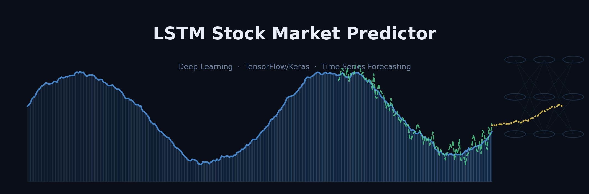
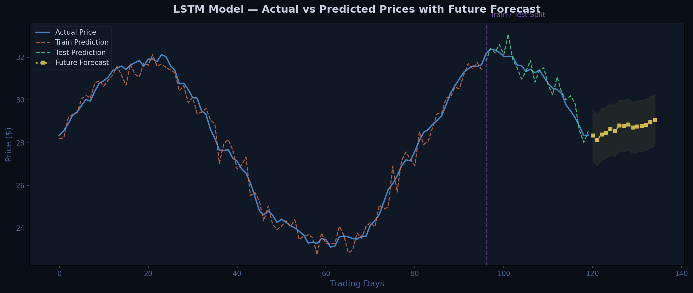
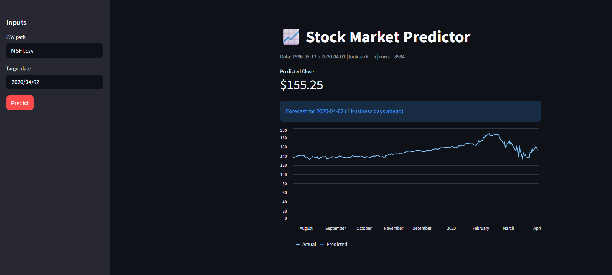

<p align="center">
  
</p>

<h1 align="center">📈 LSTM Stock Market Predictor</h1>

<p align="center">
  A deep learning project that uses <b>Long Short-Term Memory (LSTM)</b> neural networks<br>
  to predict stock market closing prices and forecast future trends.
</p>

<p align="center">
  
  
  
  
</p>

---

## 📉 Prediction Results

<p align="center">
  
</p>

> **Actual vs Predicted** closing prices on train/test data, with **10-day future forecast** shown in gold.

### Full Dashboard



---

## 🧠 How It Works

The model takes a sequence of past closing prices (a configurable **lookback window**) and learns temporal patterns to predict the next day's price. After training, it can autoregressively forecast multiple days into the future.

**Pipeline overview:**

```
CSV Data → MinMaxScaler → Sliding Window Sequences → train_test_split
    → Stacked LSTM → Dense Layers → Predictions → Inverse Transform → Evaluation
```

### Model Architecture

| Layer | Type            | Output Shape   | Parameters |
| ----- | --------------- | -------------- | ---------- |
| 1     | LSTM (64 units) | (batch, 5, 64) | 16,896     |
| 2     | Dropout (0.2)   | (batch, 5, 64) | 0          |
| 3     | LSTM (64 units) | (batch, 64)    | 33,024     |
| 4     | Dropout (0.2)   | (batch, 64)    | 0          |
| 5     | Dense (ReLU)    | (batch, 32)    | 2,080      |
| 6     | Dense (Linear)  | (batch, 1)     | 33         |

**Total trainable parameters:** 52,033

---

## 🚀 Quick Start

### Prerequisites

- Python 3.9+
- pip

### Installation

```bash
# Clone the repository
git clone https://github.com/yourusername/lstm-stock-predictor.git
cd lstm-stock-predictor

# Install dependencies
pip install -r requirements.txt
```

### Run with Sample Data

```bash
python lstm_stock_predictor.py
```

### Run with Your Own Data

Prepare a CSV file with `Date` and `Close` columns:

```csv
Date,Close
2024-01-02,150.25
2024-01-03,152.10
2024-01-04,149.80
...
```

Then modify the `main()` call:

```python
# At the bottom of lstm_stock_predictor.py
if __name__ == "__main__":
    main(csv_path="your_data.csv")
```

---

## ⚙️ Configuration

All hyperparameters are in the `CONFIG` dictionary at the top of the script:

```python
CONFIG = {
    "lookback": 5,            # Past days used as input sequence
    "hidden_units": 64,       # LSTM units per layer
    "num_layers": 2,          # Stacked LSTM layers
    "dropout": 0.2,           # Dropout rate
    "epochs": 150,            # Max training epochs
    "batch_size": 16,         # Mini-batch size
    "learning_rate": 0.001,   # Initial Adam learning rate
    "test_size": 0.2,         # Test set fraction (train_test_split)
    "forecast_days": 10,      # Days to predict into the future
}
```

**Tuning tips:**

- Increase `lookback` for longer-term pattern recognition (try 10–30 for daily data)
- Increase `hidden_units` and `num_layers` for larger datasets
- Lower `learning_rate` if training is unstable
- The model needs **200+ data points** to generalize well

---

## 📊 Output

The script generates three outputs in the working directory:

| File                        | Description                                |
| --------------------------- | ------------------------------------------ |
| `lstm_stock_prediction.png` | 6-panel visualization dashboard            |
| `lstm_model.keras`          | Saved model weights (reloadable)           |
| Console output              | Training logs, metrics, and forecast table |

### Dashboard Panels

1. **Predictions & Forecast** — actual vs predicted prices with train/test split line and future forecast
2. **Loss Curve** — training and validation MSE over epochs
3. **Actual vs Predicted Scatter** — how close predictions are to the perfect diagonal
4. **Error Distribution** — histogram of prediction residuals
5. **Forecast Detail** — zoomed-in view of recent prices and future predictions with dollar annotations

### Evaluation Metrics

| Metric | Description                                                 |
| ------ | ----------------------------------------------------------- |
| RMSE   | Root Mean Squared Error — penalizes large errors            |
| MAE    | Mean Absolute Error — average dollar error                  |
| R²     | Coefficient of Determination — 1.0 is perfect               |
| MAPE   | Mean Absolute Percentage Error — scale-independent accuracy |

---

## 🔄 Loading a Saved Model

```python
from tensorflow.keras.models import load_model

model = load_model("lstm_model.keras")

# Use for predictions
import numpy as np
sequence = np.array([...])  # shape: (1, lookback, 1)
prediction = model.predict(sequence)
```

---

## 📁 Project Structure

```
lstm-stock-predictor/
├── lstm_stock_predictor.py     # Main script (data, model, training, plots)
├── requirements.txt            # Python dependencies
├── README.md                   # This file
├── lstm_stock_prediction.png   # Generated chart (after running)
└── lstm_model.keras            # Saved model (after running)
```

---

## 🛠️ Tech Stack

- **[TensorFlow / Keras](https://www.tensorflow.org/)** — LSTM model, training, and inference
- **[scikit-learn](https://scikit-learn.org/)** — `train_test_split`, `MinMaxScaler`, evaluation metrics
- **[pandas](https://pandas.pydata.org/)** — data loading and date handling
- **[NumPy](https://numpy.org/)** — numerical operations
- **[Matplotlib](https://matplotlib.org/)** — visualization dashboard

---

## 📝 Key Concepts

### Why LSTM?

Standard neural networks have no memory of previous inputs. LSTMs solve this with a **cell state** and **gating mechanisms** (forget, input, output gates) that learn which information to keep or discard across time steps — making them well-suited for sequential data like stock prices.

### Why `shuffle=False` in `train_test_split`?

Stock prices are **time-dependent**. Shuffling would leak future information into the training set (data leakage), producing misleadingly good metrics. Setting `shuffle=False` preserves chronological order: the model trains on earlier data and is tested on later data.

### Limitations

- Stock markets are influenced by external factors (news, earnings, geopolitics) that price history alone cannot capture
- The model uses only closing price as a single feature — adding volume, moving averages, or technical indicators could improve performance
- With very small datasets (< 100 points), the model may not generalize well
- **This is an educational project — not financial advice**

---

## 🤝 Contributing

Contributions are welcome! Some ideas for improvement:

- [ ] Add multi-feature support (Open, High, Low, Volume)
- [ ] Implement walk-forward validation
- [ ] Add confidence intervals to forecasts
- [ ] Integrate live data fetching (e.g., `yfinance`)
- [ ] Add command-line arguments with `argparse`
- [ ] Implement GRU and Transformer baselines for comparison

---

## 📄 License

This project is licensed under the MIT License — see the [LICENSE](LICENSE) file for details.

---

## ⚠️ Disclaimer

This project is for **educational and research purposes only**. It is not intended as financial advice. Stock market predictions are inherently uncertain, and past performance does not guarantee future results. Always consult a qualified financial advisor before making investment decisions.

---

## 📩 Contact

For any questions or inquiries, feel free to reach out:

- **Email:** [atefkabani@gmail.com](mailto:atefkabani@gmail.com)
- **LinkedIn:** [Atef Elkabbani](https://www.linkedin.com/in/atef-elkabbani-76734317a/)
- **Mobile:** +966 58 307 2000

---

<p align="center">
  Let's make accurate stock market predictions together!<br><br>
  Thank you for visiting our project repository. Happy predicting! 😇<br><br>
  ⭐ <i>If you found this useful, consider giving the repo a star!</i> ⭐
</p>
